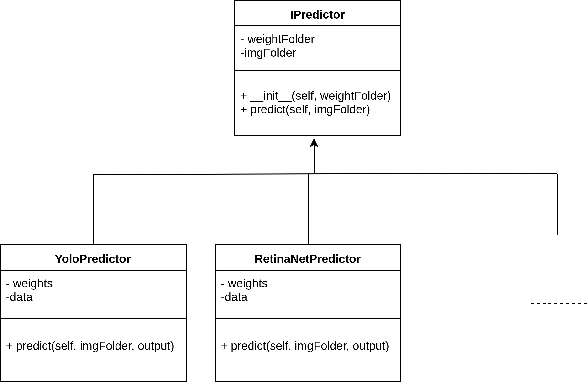

# Ensemble methods for object detection

In this repository, we provide the code for ensembling the output of object detection models, and applying test-time augmentation for object detection. This library has been designed to be applicable to any object detection model independently of the underlying algorithm and the framework employed to implement it. A draft describing the techniques implemented in this repository are available in the following [article](https://drive.google.com/file/d/1ku8X8lHs6lethEa5Adhj7frzV44NTbl4/view?usp=sharing).

### Colaboratory Notebooks for prediction

The simplest way to use this repository is through the following notebooks.

- [Ensemble Model Notebook](https://colab.research.google.com/drive/1Tg9WaI_Cd-lPXDMuj6tHDlqakxo4-CLK)
- [Test Time Augmentation Notebook](https://colab.research.google.com/drive/1T1mn85AedRlaTNHeJW_QeTy0I5wOy14J)

## Test-Time Augmentation and Model Ensemble
We provides the necessary tools to apply ensemble methods and test-time augmentation (TTA). This open-source library can be  extended to work with any object detection  model  independently of the algorithm and framework employed to construct it.

### Ensemble Options
You can be taken using three different voting strategies:
*   Affirmative. This means that whenever one of the methods that produce the 
initial predictions says that a region contains an object, such a detection is considered as valid.
*   Consensus. This means that the majority of the initial methods must agree to consider that a region contains an object. The consensus strategy is analogous to the majority voting strategy commonly applied in ensemble methods for images classification.
*   Unanimous. This means that all the methods must agree to consider that a region contains an object.

### Techniques of TTA
These are all the techniques that we have defined to use in the test-time augmentation. The first column corresponds to the name assigned to the code and the second column to the name of the technique.
- "avgBlur": average_blurring
- "bilaBlur":bilateral_blurring 
- "blur": blurring
- "chanHsv":change_to_hsv
- "chanLab":blurring
- "crop":crop
- "dropOut":dropout
- "elastic": elastic
- "histo": equalize_histogram
- "vflip": flip
- "hflip": flip
- "hvflip": flip
- "gamma": gamma
- "blurGau": gaussian_blur
- "avgNoise": gaussian_noise
- "invert": invert
- "medianblur": median_blur
- "none": none
- "raiseBlue": raise_blue
- "raiseGreen": raise_green
- "raiseHue": raise_hue
- "raiseRed": raise_red
- "raiseSatu": raise_saturation
- "raiseValue": raise_value
- "resize": resize
- "rotation10": rotate
- "rotation90":rotate
- "rotation180": rotate
- "rotation270": rotate
- "saltPeper":salt_and_pepper
- "sharpen": sharpen
- "shiftChannel":shift_channel
- "shearing":shearing
- "translation": translation
    
### Model Ensemble
As we have said before, this open source library can be expanded to work with any object detection model regardless of the algorithm and framework used to build it. As we can see in the following diagram:



## Citation

Use this bibtex to cite this work:

```
@misc{CasadoGarcia19,
  title={Ensemble Methods for Object Detection},
  author={A. Casado-García and J. Heras},
  year={2019},
  note={\url{https://github.com/ancasag/ensembleObjectDetection}},
}
```

## Acknowledgments
This work was partially supported by Ministerio de Economía y Competitividad [MTM2017-88804-P], Ministerio de Ciencia, Innovación y Universidades [RTC-2017-6640-7], Agencia de Desarrollo Económico de La Rioja [2017-I-IDD-00018], and the computing facilities of Extremadura Research Centre for Advanced Technologies (CETA-CIEMAT), funded by the European Regional Development Fund (ERDF). CETA-CIEMAT belongs to CIEMAT and the Government of Spain. We also thank Álvaro San-Sáez for providing us with the stomata datasets.
